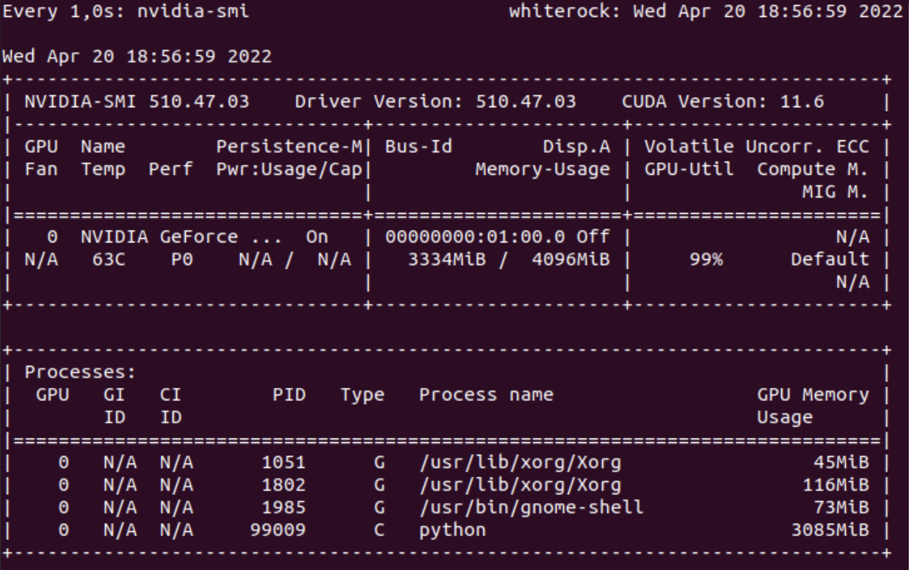

# RAPIDS/CUDA for GPU acceleration on Dataframe/cuDF and Graph/cuGraph processings vs Macbook m1 architecture

This project is built and maintained by Tiago Oliveira - [ti.olive@gmail.com](https://www.linkedin.com/in/tiagoliveira/).

It aims to explore statistics for Loading,joining dataframes and performs some Graph Operations to compare the performance from different computer architecture: Ubuntu Laptop GPU accelerated vs Macbook M1 Pro. 

It is important to emphasize the efficiency gain in performance for using the GPU not only in the training of Deep Learning Models, but also for regular data transformation operations. The performance gain compared to CPU-only libraries is really impressive. So when performance is the most relevant attribute **on designing ETL processes, for sure it worth it rather to leverage GPU accelerated libraries**.

It is recommended to keep an eye on the news that the NVIDIA team has contributed to the [RAPIDS AI](https://rapids.ai/) project - also in the [git](https://github.com/rapidsai/)

* Setup 1 - MacOS
  * OS: macOS Monterey 12.1, Apple M1 Pro
  * Memory: 32GB
  * SSD: 1TB

* Setup 2 - Ubuntu GPU
  * OS: Ubuntu 20.04.4 LTS
  * Graphics: NVIDIA Corporation GP107M [GeForce GTX 1050 Ti Mobile] / NVIDIA GeForce GTX 1050 Ti/PCIe/SSE2
  * Processor: Intel® Core™ i7-7700HQ CPU @ 2.80GHz × 8
  * Memory: 31,2 GiB
  * SSD: 256GB
  * Disk: 1,3 TB

* Setup 3 - Databricks Spark Cluster

### References literature

### References - Code

* cuDF vs Pandas
* cuGraph vs NetworkX

### Videos & lectures

### Blog posts

### Next steps
Here is just a playground for Dataframe and Graph processings backed by GPU accelerated libraries from NVIDIA - RAPIDS [cuDF, cuGraph](https://github.com/rapidsai/) in order to create such a comparison between regular desktop CPU-GPU architecture versus [Macbook m1](https://www.theverge.com/2021/10/26/22746371/macbook-pro-m1-max-apple-gpu-performance-nvidia-amd) 

### Application Architectural Challenge

### Data Science Model Architectural Challenge
